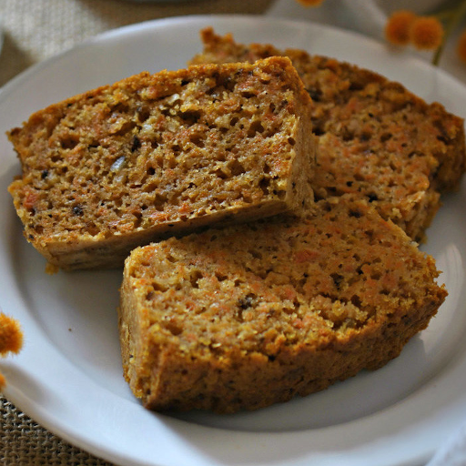

## Bizcocho de zanahoria (Juan)

La miga de este bizcocho es densa, pero jugosa y húmeda. En ello interviene la
zanahoria, que juega un papel maravilloso. No confundáis este bizcocho de
zanahoria con un carrot cake o pastel de zanahoria, no tiene nada que ver. Esta
es una receta fácil, sin florituras, ni especias, ni crema de queso como
cobertura. No lo necesita para conquistar vuestros paladares. ¿Lo comprobamos?

### Ingredientes

Para 2 unidades

- Zanahoria pelada 250 g
- Nueces 30 g
- Huevos "M" 2
- Azúcar 125 g
- Harina de trigo 70 g
- Levadura química 10 g
- Esencia de vainilla 5 g
- Aceite de girasol 25 g
- Sal pizca

### Elaboración

Dificultad: Fácil

- Tiempo total 50 m
- Elaboración 10 m
- Cocción 40 m

Rallamos las zanahorias, picamos las nueces y las mezclamos. Si tenemos un
robot de cocina, podemos poner ambos ingredientes en el vaso y triturar. Será
más rápido. Si no tenemos nueces o no nos gustan, podemos sustituirlas por otro
fruto seco como la avellana o la almendra. Cualquiera de ellos aportará un
toque interesante de sabor y textura al bizcocho.

Batimos ligeramente los huevos con el azúcar en un recipiente hondo. Añadimos
la harina y el impulsor químico tamizados, junto con un pellizco de sal.
Mezclamos hasta integrar. Incorporamos la esencia de vainilla, el aceite
vegetal y removemos de nuevo. Por último añadimos la zanahoria y nueces
trituradas y mezclamos bien.

Cubrimos la base de dos moldes de cake de 16x8 cm con papel sulfurizado y
repartimos la masa entre ellos. Podemos usar un solo molde más grande, pero a
mi me gusta este tamaño porque me permite congelar uno de ellos de forma
cómoda. Cocemos en horno precalentado a 180ºC durante 35-40 minutos o hasta que
comprobemos al tocar la superficie con el dedo que los bizcochos están listos.

### Con qué acompañar el bizcocho de zanahoria

La textura densa y la miga húmeda y jugosa de este bizcocho de zanahoria hacen
de él un dulce muy especial. El punto de dulzor es bajo y quizás queráis
ajustarlo a vuestros gustos, pero nosotros consideramos que es el adecuado. Es
perfecto para comer a la hora del desayuno o la merienda, una alternativa sana
y saludable para toda la familia..

Fuente:
[https://www.directoalpaladar.com/recetario/bizcocho-de-zanahoria-receta-facil](https://www.directoalpaladar.com/recetario/bizcocho-de-zanahoria-receta-facil)
